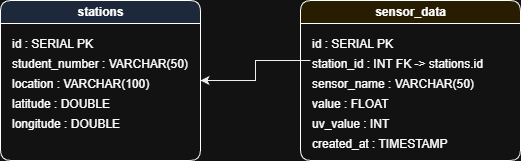

# centralServer

centralServer is a school project for storing and visualizing data from the group's weather stations located across the Netherlands.

Table of Contents
- [Project overview](#project-overview)
- [Repository structure](#repository-structure)
- [Getting started](#getting-started)
- [Frontend](#frontend)

## Project overview
This repository provides a central server to collect and store sensor readings from multiple weather stations maintained by our group. The Backend provides a REST API to accept and serve data. The Frontend displays station locations on a map of the Netherlands and lets users inspect recent readings.

## Repository structure
- [`Backend/`](Backend/:1) - server code and API (see backend README if present)
- [`Frontend/`](Frontend/:1) - minimal React frontend (map + basic UI)
- [`Hosten/`](Hosten/:1) - hosting / deployment notes (optional)

## Getting started
Prerequisites:
- Node.js >= 16 and npm (for Frontend). If the Backend requires other runtimes follow its README.

Quick start (Frontend):
1. Open a terminal and change to the frontend folder:
   cd Frontend
2. Install dependencies:
   npm install
3. Start the dev server:
   npm run dev
4. Open http://localhost:5173 in your browser (default Vite port). If the project uses a different port see the output in the terminal.

## Frontend
The Frontend in [`Frontend/`](Frontend/:1) is a small React app that shows station markers on a map of the Netherlands. It is intentionally minimal so everyone can extend it for the project:
- Map implementation: a simple Leaflet map (OpenStreetMap tiles) or a vector map using react-simple-maps. The repo includes an example component that centers the map on the Netherlands and shows sample station markers.
- How to configure: set the backend API base URL in `src/config.js` or via environment variables.

## Backend
- Server code and API to handle sensor data from stations.
- Stores readings in PostgreSQL database.
- Provides REST endpoints for retrieving station and sensor information.
- Database schema for reference:
- 
- [Draw.io XML File](postgres_db_schema.xml)